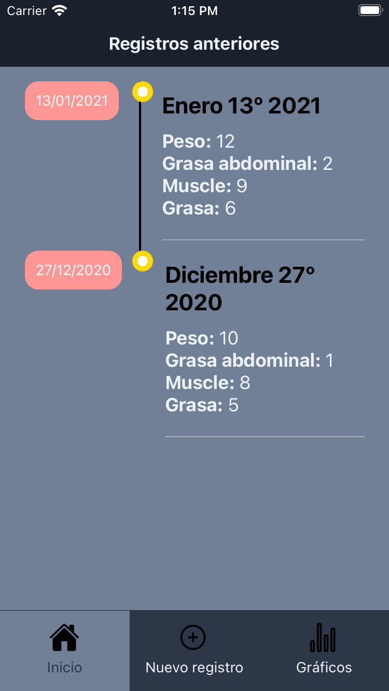
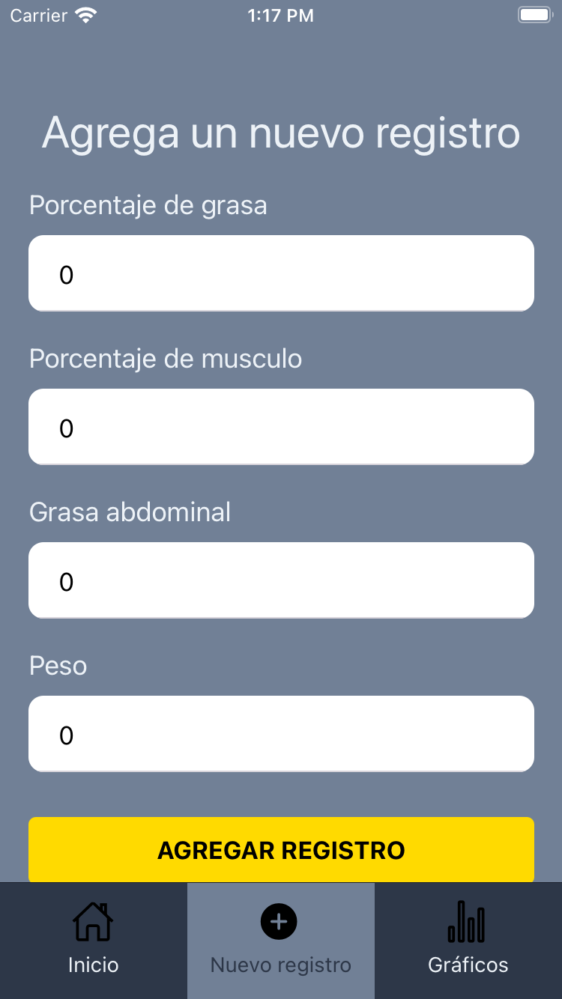
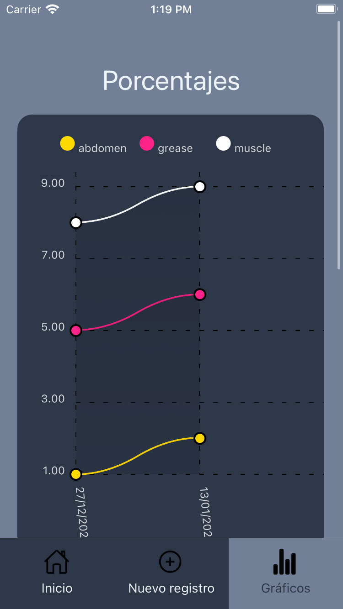
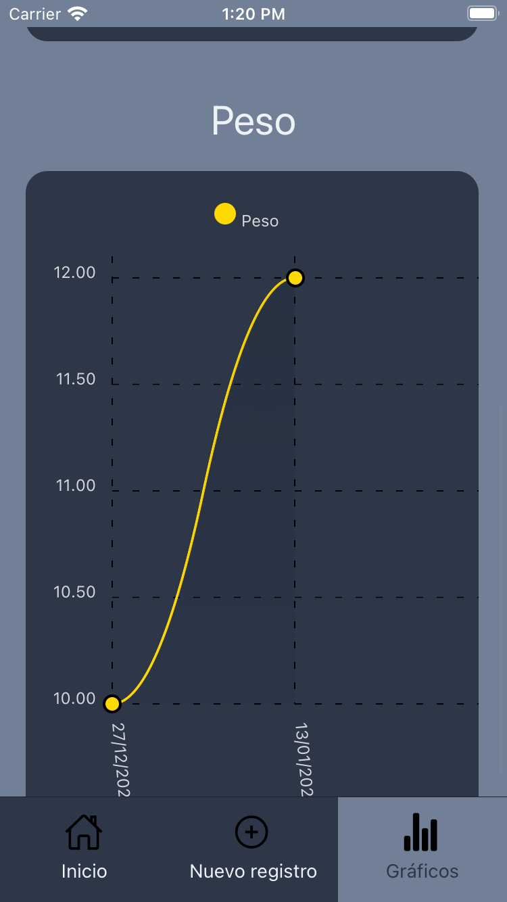

# Weigth Track

It's an app for health tracking, the app record weight, abdominal fat, muscle and grease, the app was develop with React Native, the views and UI is in Spanish

The app consist in three sections Home, New register, Graphics, it's important to say that the app works with firebase so you have to have a app register in firebase and create a file called **config** in the firebase folder, inside paste the config provided by firebase and then exports

## Home

It's a timeline with the data recorded previously

## Add Register

It's a form with the inputs required to save a record, **YUP and Formik** is applied to validate the form

## Graphics

Contains a two line graphic with porcentages ( abdominal fat, muscle and grease )

and other with the weigth

